# Chat Service - Real-Time Messaging Platform

A robust, scalable real-time messaging service built with Spring Boot that enables secure one-to-one chat communication with media sharing capabilities.

## 🌟 Key Features

- 🔐 **Secure Authentication** - OAuth2/JWT integration with Keycloak
- 💬 **Real-time Messaging** - WebSocket with STOMP protocol
- 📁 **Media Support** - Text, images, audio, and video messaging
- 🔄 **User Synchronization** - Automatic user profile updates from JWT claims
- 📱 **RESTful API** - Clean, well-documented endpoints
- 🛡️ **Message Status Tracking** - Sent/Seen indicators
- 📊 **Online Presence** - Real-time user availability detection

## 🏗️ Architecture Overview

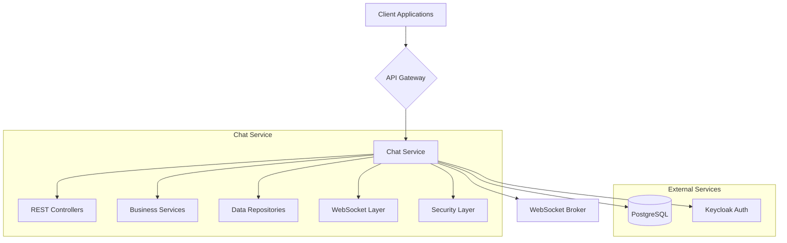

## 📦 Technology Stack

- **Framework**: Spring Boot 3.5.6
- **Language**: Java 21
- **Database**: PostgreSQL
- **Security**: OAuth2 Resource Server, JWT
- **Real-time**: WebSocket + STOMP
- **Documentation**: OpenAPI/Swagger
- **Build Tool**: Maven

## 🧱 Core Domain Model

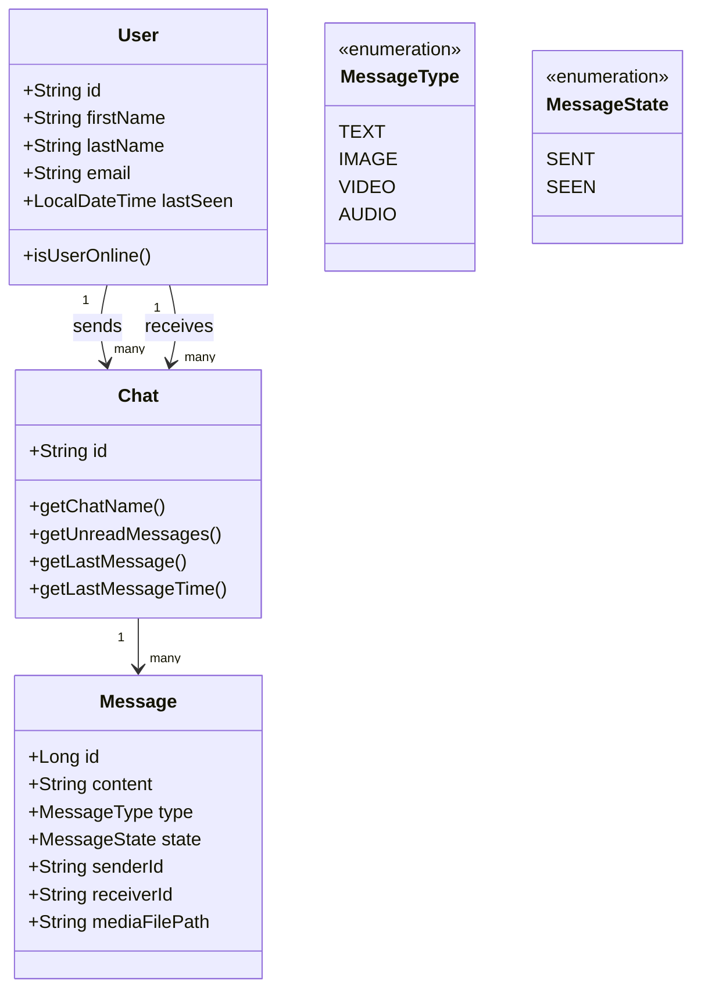

## 🔄 Service Communication Flow

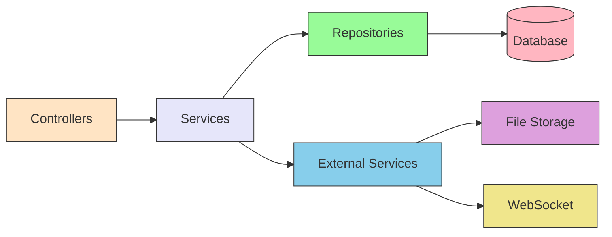

## 🎯 Component Interaction Patterns

### 1. User Authentication & Synchronization

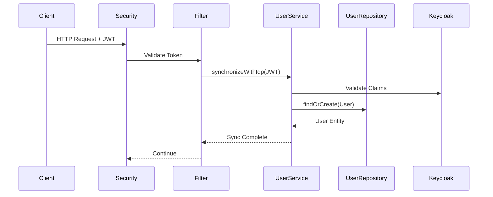

### 2. Message Delivery Flow

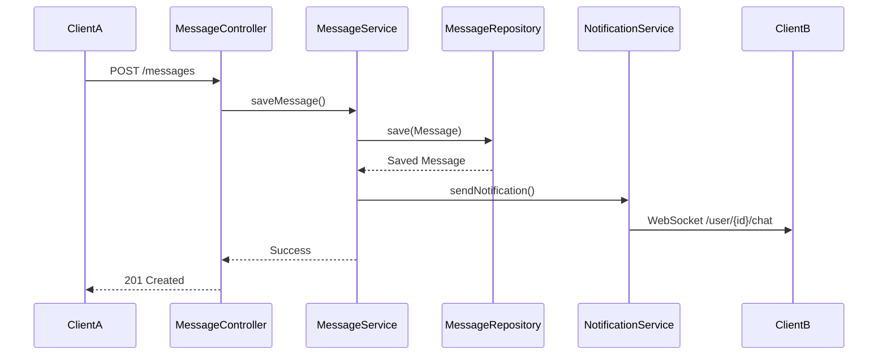

### 3. Chat Creation Process

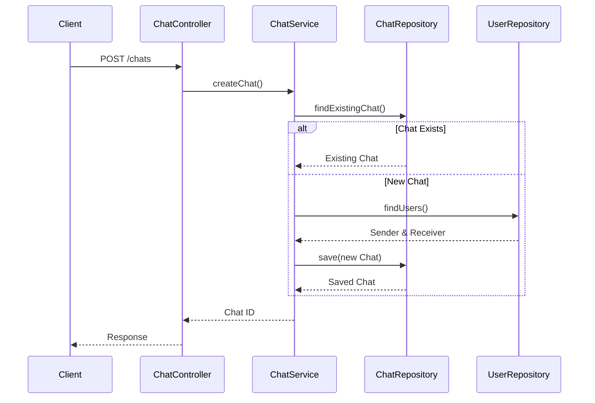

## 📡 WebSocket Communication

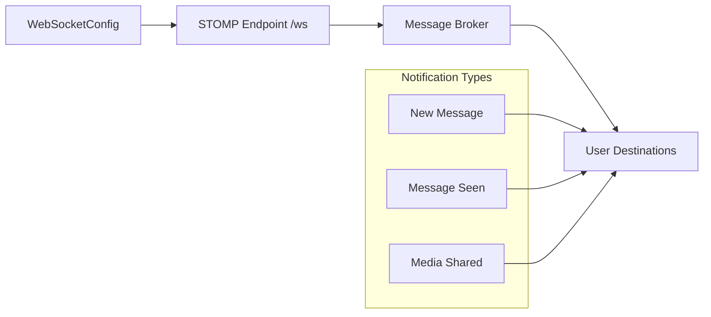

## 🗃️ Data Flow Architecture

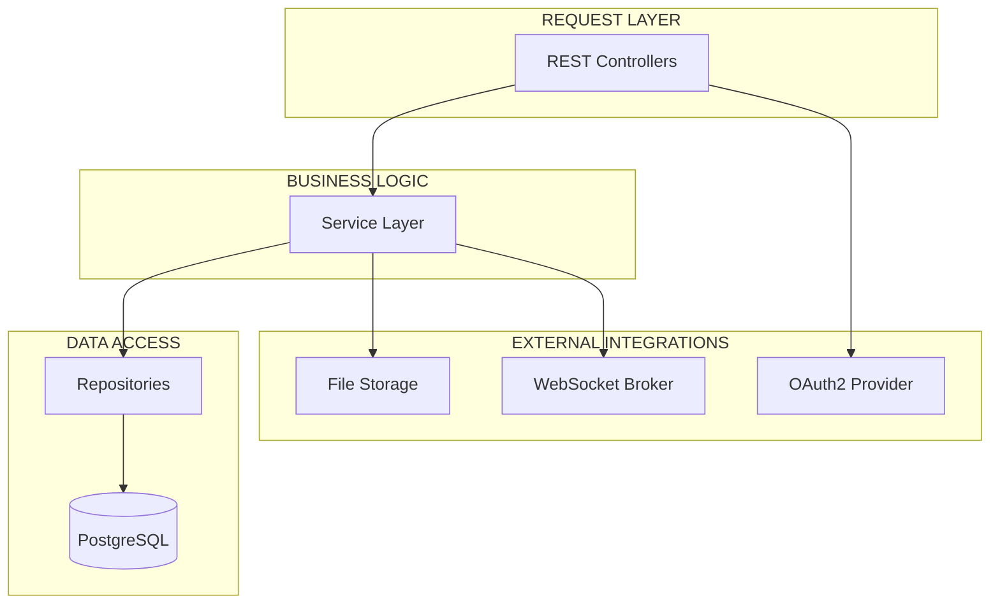

## 🔧 Class Relationships Map

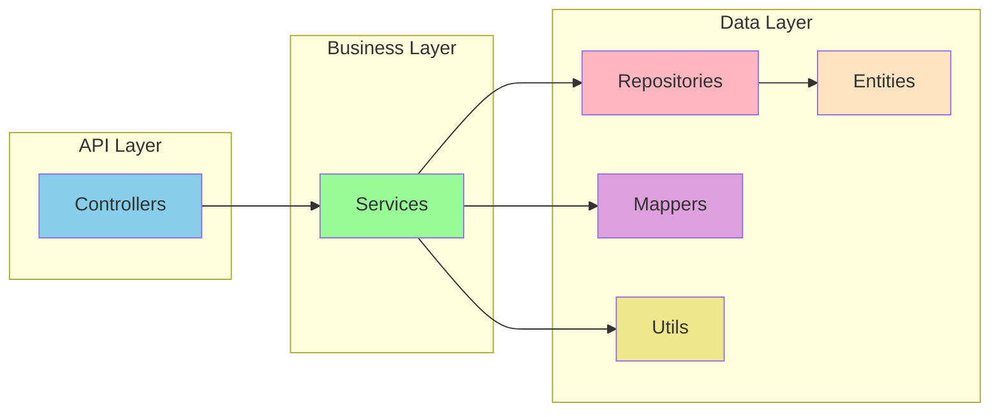

## 🚀 REST API Endpoints

### User Management
```
GET /api/v1/users              # Get all users except self
```

### Chat Management
```
POST /api/v1/chats             # Create/reuse chat
GET /api/v1/chats              # Get user's chats
```

### Message Management
```
POST /api/v1/messages          # Send text message
POST /api/v1/messages/upload-media  # Upload media
PATCH /api/v1/messages         # Mark messages as seen
GET /api/v1/messages/chat/{id} # Get chat messages
```

## 🔐 Security Flow

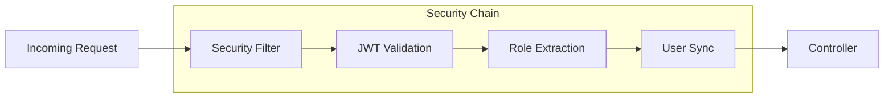

## 📁 File Storage Architecture

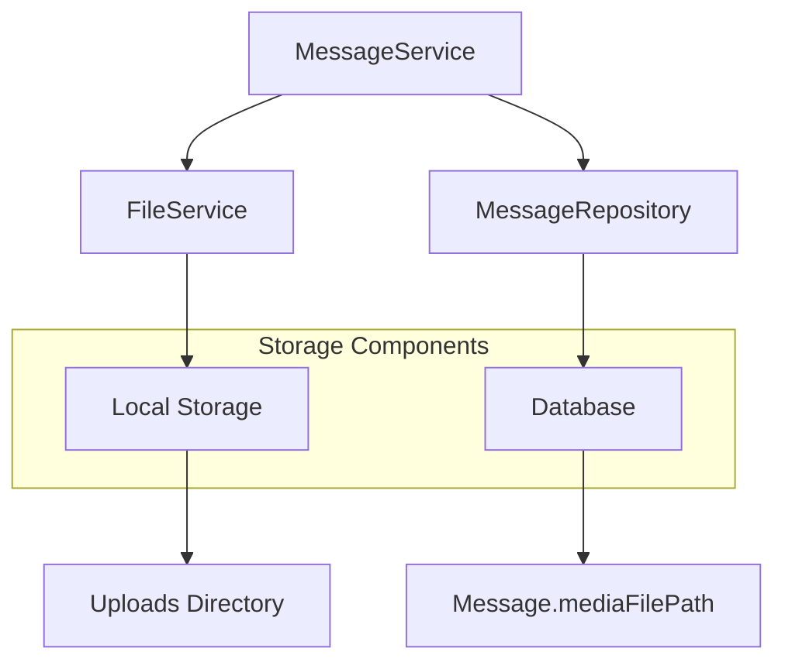

## 📊 Service Layer Responsibilities

### UserService
- User profile management
- User listing and filtering
- Online status calculation

### ChatService
- Chat session creation
- Chat history retrieval
- Unread message counting

### MessageService
- Message persistence
- Media file handling
- Notification dispatching
- Message state management

### NotificationService
- WebSocket message broadcasting
- User-specific routing
- Real-time delivery

## ⚙️ Configuration Highlights

### Database Configuration
```yaml
spring:
  datasource:
    url: jdbc:postgresql://localhost:5432/chat-db
    username: ${DB_USERNAME:anas}
    password: ${DB_PASSWORD:anas}
  jpa:
    hibernate:
      ddl-auto: update
```

### WebSocket Configuration
```yaml
websocket:
  endpoint: /ws
  allowed-origins: http://localhost:4200
```

### File Upload Settings
```yaml
application:
  file:
    uploads:
      media-output-path: ./uploads
spring:
  servlet:
    multipart:
      max-file-size: 50MB
```

## 🏃 Running the Service

### Prerequisites
1. Java 21+
2. PostgreSQL database
3. Keycloak or OAuth2 provider

### Quick Start
```bash
# Navigate to chat-service directory
cd chat-service

# Run with Maven
./mvnw spring-boot:run

# Or build and run JAR
./mvnw clean package
java -jar target/chat-service-0.0.1-SNAPSHOT.jar
```

### Docker Deployment
```bash
# Build Docker image
docker build -t chat-service .

# Run container
docker run -p 8080:8080 chat-service
```

## 🧪 Testing Endpoints

### Swagger UI
Once running, access API documentation at:
```
http://localhost:8080/swagger-ui.html
```

### WebSocket Testing
Connect to WebSocket endpoint:
```
ws://localhost:8080/ws
```

## 📈 Performance Considerations

### Database Optimization
- Proper indexing on user_id and chat_id columns
- Eager loading for frequently accessed relationships
- Connection pooling configuration

### WebSocket Scalability
- User-specific message routing
- Efficient payload serialization
- Connection lifecycle management

### File Storage
- Local file system for development
- Cloud storage (S3, Azure Blob) for production
- CDN integration for media delivery

## 🔧 Troubleshooting

### Common Issues
1. **Database Connection**: Verify PostgreSQL is running and credentials are correct
2. **JWT Validation**: Ensure Keycloak is accessible and issuer URL matches
3. **WebSocket CORS**: Check allowed origins in WebSocket configuration
4. **File Uploads**: Verify upload directory permissions

### Health Checks
```bash
# Application health
GET /actuator/health

# Database connectivity
GET /actuator/health/db

# WebSocket status
GET /actuator/health/websocket
```

## 📚 Additional Resources

- [Spring Boot Documentation](https://spring.io/projects/spring-boot)
- [Spring Security OAuth2](https://docs.spring.io/spring-security/reference/servlet/oauth2/index.html)
- [WebSocket with Spring](https://docs.spring.io/spring-framework/reference/web/websocket.html)
- [PostgreSQL Documentation](https://www.postgresql.org/docs/)

---
*This documentation provides a comprehensive overview of the chat service architecture, component interactions, and operational guidelines.*