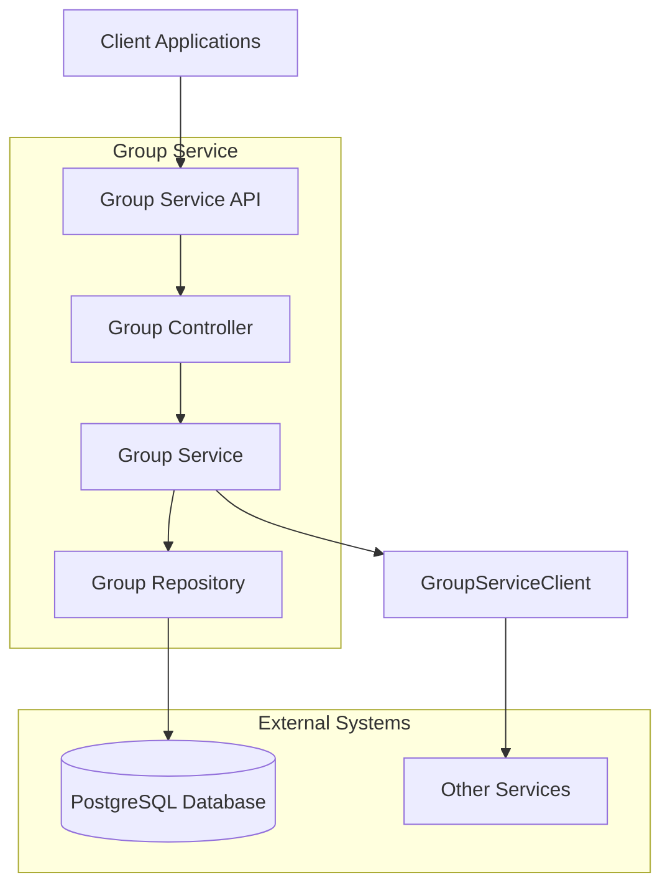
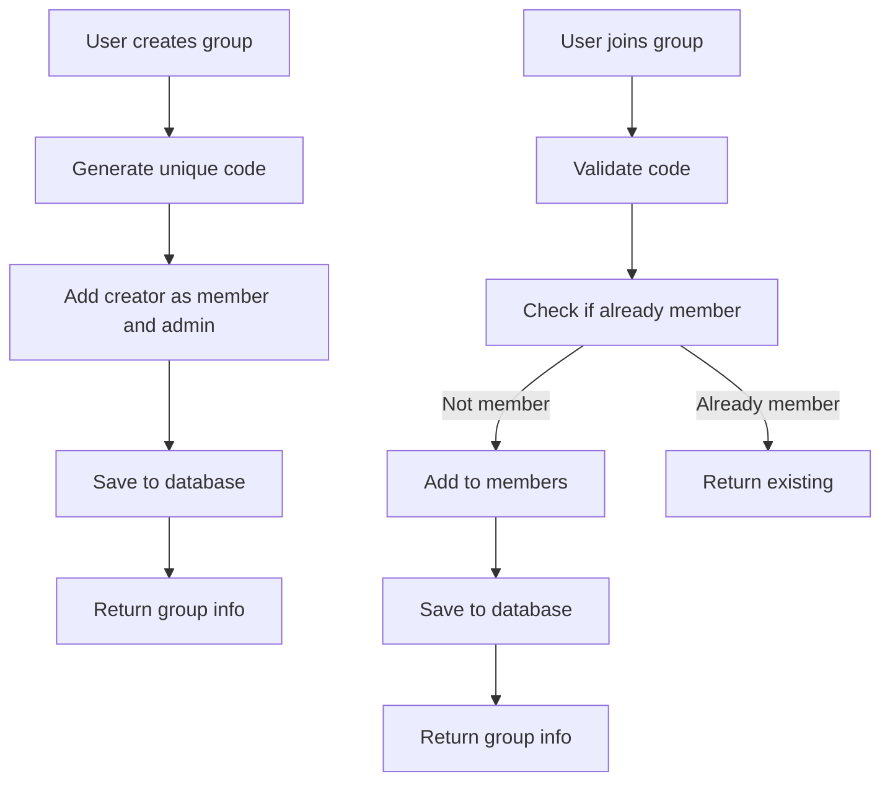

# Group Service

## Overview
The Group Service is a microservice that manages study groups within the education platform. It allows teachers to create groups with unique shareable codes, and students to join these groups using the codes.

## Features
- Create study groups with unique shareable codes
- Join/leave groups using codes
- Role-based access control (members vs admins)
- Group search and discovery
- RESTful API with JSON responses
- Integration with other services via Feign clients
- OAuth2/JWT authentication with Keycloak
- PostgreSQL database storage
- OpenAPI/Swagger documentation

## Architecture Diagram

## API Endpoints

### Group Management
- `POST /api/v1/groups` - Create a new group
- `GET /api/v1/groups/{id}` - Get group by ID
- `GET /api/v1/groups/code/{code}` - Get group by code
- `GET /api/v1/groups/my` - Get groups for current user
- `PUT /api/v1/groups/{id}` - Update group
- `DELETE /api/v1/groups/{id}` - Delete group

### Membership Management
- `POST /api/v1/groups/join/{code}` - Join group by code
- `POST /api/v1/groups/{id}/leave` - Leave group

### Administration
- `POST /api/v1/groups/{id}/admin/{adminId}` - Add admin
- `DELETE /api/v1/groups/{id}/admin/{adminId}` - Remove admin

### User Status
- `GET /api/v1/groups/{id}/member` - Check if user is member
- `GET /api/v1/groups/{id}/admin` - Check if user is admin

## Database Schema
The service uses a PostgreSQL database with the following main table:

### groups
- id (Primary Key)
- name (Unique)
- code (Unique)
- description
- created_by
- active
- created_date
- last_modified_date

### group_members
- group_id (Foreign Key)
- member_id

### group_admins
- group_id (Foreign Key)
- admin_id

## Workflow Diagram

## Configuration
The service runs on port 8083 by default and connects to a PostgreSQL database named `group-db`.

## Dependencies
- Spring Boot
- Spring Data JPA
- Spring Security OAuth2
- PostgreSQL
- Lombok
- Spring Cloud OpenFeign
- SpringDoc OpenAPI

## Feign Client
The service provides a Feign client for integration with other services:
`com.anas.groupservice.client.GroupServiceClient`

## Model
The service provides a model class for use by other services:
`com.anas.groupservice.model.Group`