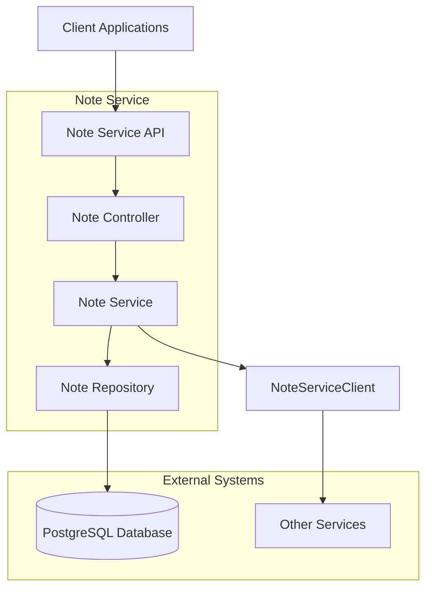
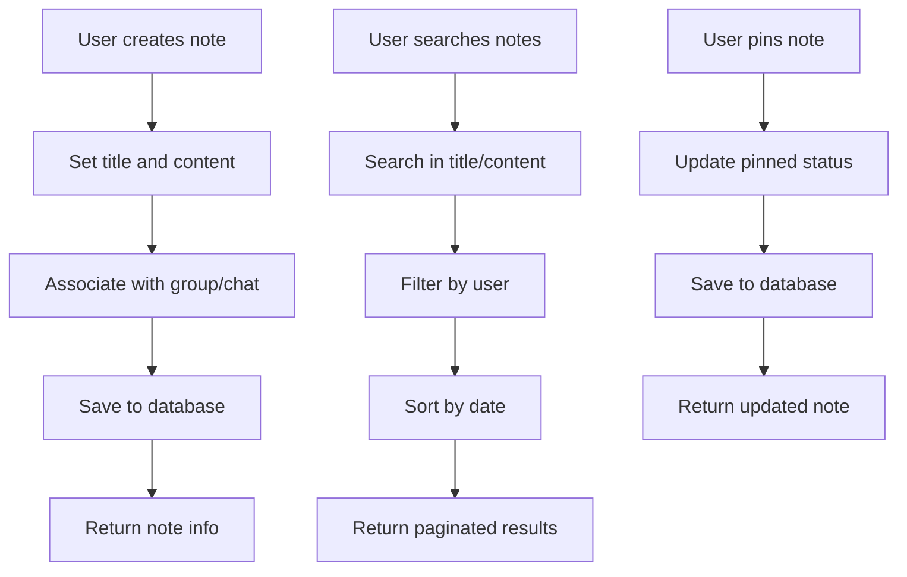

# Note Service

## Overview
The Note Service is a microservice that allows students to create personal notes during chat discussions in the education platform. Notes can be associated with specific groups or chats for better organization.

## Features
- Create, read, update, and delete personal notes
- Associate notes with groups and chats
- Search notes by keywords
- Pin important notes for quick access
- RESTful API with JSON responses
- Integration with other services via Feign clients
- OAuth2/JWT authentication with Keycloak
- PostgreSQL database storage
- OpenAPI/Swagger documentation

## Architecture Diagram

## API Endpoints

### Note Management
- `POST /api/v1/notes` - Create a new note
- `GET /api/v1/notes/{id}` - Get note by ID
- `PUT /api/v1/notes/{id}` - Update note
- `DELETE /api/v1/notes/{id}` - Delete note

### Note Retrieval
- `GET /api/v1/notes` - Get all notes for user
- `GET /api/v1/notes/group/{group-id}` - Get notes for a group
- `GET /api/v1/notes/chat/{chat-id}` - Get notes for a chat
- `GET /api/v1/notes/search` - Search notes by term
- `GET /api/v1/notes/pinned` - Get pinned notes
- `GET /api/v1/notes/count` - Get note count

## Workflow Diagram

## Database Schema
The service uses a PostgreSQL database with the following main table:

### notes
- id (Primary Key)
- title
- content
- user_id
- group_id
- chat_id
- pinned
- created_date
- last_modified_date

## Configuration
The service runs on port 8084 by default and connects to a PostgreSQL database named `note-db`.

## Dependencies
- Spring Boot
- Spring Data JPA
- Spring Security OAuth2
- PostgreSQL
- Lombok
- Spring Cloud OpenFeign
- SpringDoc OpenAPI

## Feign Client
The service provides a Feign client for integration with other services:
`com.anas.noteservice.client.NoteServiceClient`

## Model
The service provides a model class for use by other services:
`com.anas.noteservice.model.Note`