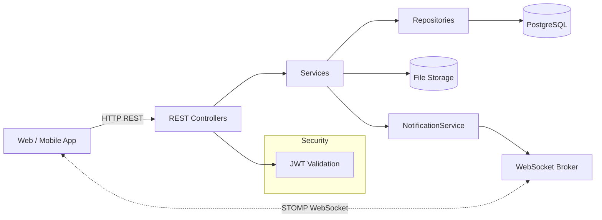
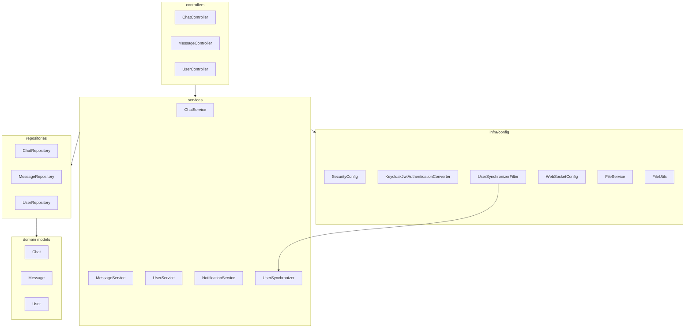
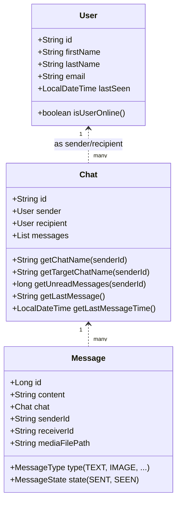
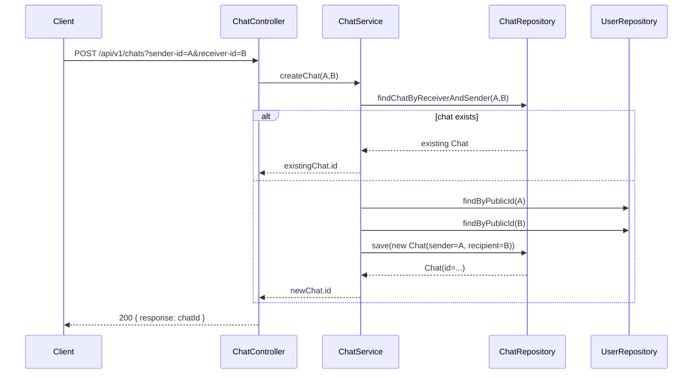
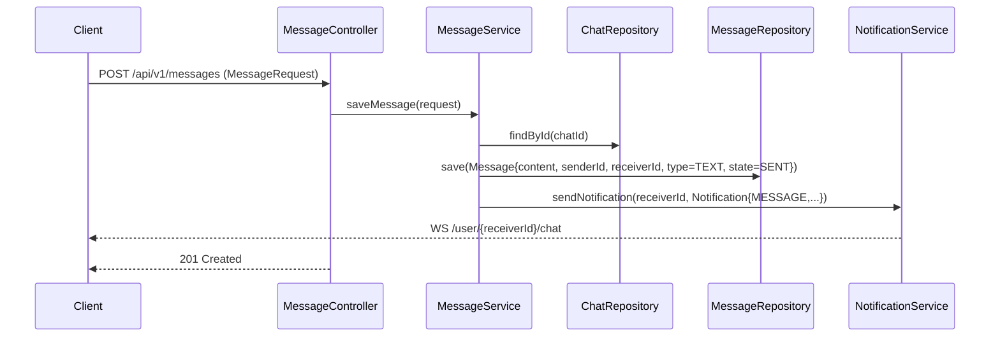
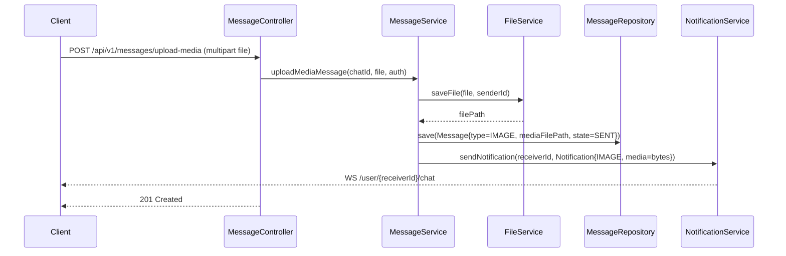
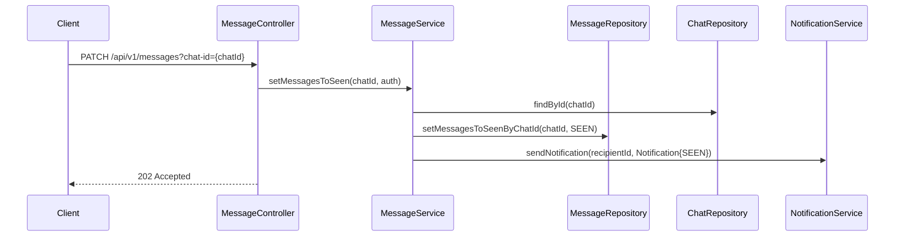
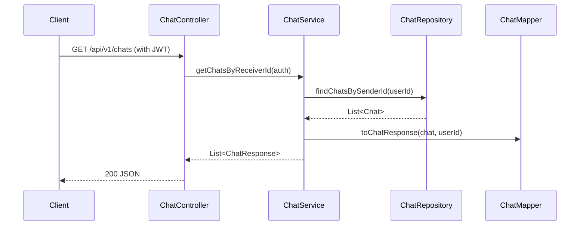

# Chat Service – Project Guide (A to Z)

This document explains how the backend chat service works, step by step, with simple language and diagrams. You’ll learn what each part does, how requests flow through the system, and what the key methods are used for.

## What this service does
- Manages 1-to-1 chats between users
- Stores users, chats, and messages in PostgreSQL
- Secures APIs using JWT (from Keycloak or another OpenID Connect provider)
- Sends real‑time notifications over WebSocket (STOMP) to connected users
- Supports text and media messages (e.g., images)

## Technology stack
- Java 21, Spring Boot 3.5.x
- Spring Web (REST), Spring Data JPA (PostgreSQL), Spring Security (OAuth2 Resource Server)
- Spring WebSocket (STOMP)
- Lombok for boilerplate reduction
- OpenAPI (springdoc) for API docs

## High-level architecture


- REST Controllers handle HTTP requests
- Services contain business logic
- Repositories query the database using JPA
- Security validates JWTs for protected endpoints
- WebSocket sends notifications to specific users (`/user/{id}/chat`)
- Media files are written to a local folder; file bytes are read when needed

## Packages map (what talks to what)


## Data model (simplified)


### Relationship in simple words
- A `User` can start many `Chat`s, and can also be the recipient in many `Chat`s.
- A `Chat` contains many `Message`s.
- Each `Message` belongs to exactly one `Chat` and stores `senderId` and `receiverId`.

## Security and authentication
- Most endpoints require a valid JWT.
- Public: API docs and `/ws` websocket handshake.
- `KeycloakJwtAuthenticationConverter` reads roles from token claims.
- `UserSynchronizerFilter` runs per request; if user is authenticated, we update/create the user record using token claims.

## WebSocket messaging
- Endpoint: `/ws` (SockJS enabled)
- User destination prefix: `/user`
- App prefix: `/app`
- Notifications go to `/user/{receiverId}/chat`.

## Configuration (application.yml)
- PostgreSQL + JPA settings, 50MB upload limit, OAuth issuer URL.
- File uploads base path: `./uploads` by default (ensure key name matches code).

## REST endpoints (summary)
- Chat: create chat, list chats of current user.
- Message: send text, upload media, mark seen, list messages by chat.
- User: list all users except the current user.

## End‑to‑end flows

### 1) Create or reuse a chat


### 2) Send a text message


### 3) Upload and send a media message


### 4) Mark messages as seen


### 5) List chats for the current user


## Class relationships explained simply
- `ChatController` talks to `ChatService`. It never touches the database directly.
- `ChatService` asks `ChatRepository` for chats; it uses `ChatMapper` to shape data for the client.
- `MessageController` talks to `MessageService` for saving, listing, uploading, and marking messages.
- `MessageService` uses `MessageRepository` to store/read messages, `ChatRepository` to validate chat, `FileService` for files, and `NotificationService` to notify the receiver.
- `UserController` talks to `UserService`, which uses `UserRepository` and `UserMapper`.
- `UserSynchronizerFilter` runs before controllers; it calls `UserSynchronizer` to upsert the user from token.

## Methods file-by-file (human description)

- `security/SecurityConfig`
  - `securityFilterChain`: enables CORS, disables CSRF for APIs, protects endpoints with JWT
  - `corsFilter`: allows requests from `http://localhost:4200`
- `security/KeycloakJwtAuthenticationConverter`
  - `convert`: adds authorities from token
  - `extractResourceRoles`: maps roles like `ROLE_user`
- `ws/WebSocketConfig`
  - Sets broker/app prefixes, registers `/ws` with SockJS, adds `@AuthenticationPrincipal` resolver
- `interceptor/UserSynchronizerFilter`
  - On each authenticated request, calls `UserSynchronizer.synchronizeWithIdp(token)`
- `user/UserSynchronizer`
  - Reads claims, finds user by email, upserts user (id from `sub`, names, email, `lastSeen=now`)
- `user/UserService`
  - `finAllUsersExceptSelf`: returns all users except the requester
- `chat/ChatService`
  - `getChatsByReceiverId`: queries chats for user, maps to `ChatResponse`
  - `createChat`: ensures a single chat per user pair (any order)
- `message/MessageService`
  - `saveMessage`: stores message and notifies receiver
  - `findChatMessages`: returns messages mapped to `MessageResponse`
  - `setMessagesToSeen`: bulk-updates state to SEEN and notifies the other user
  - `uploadMediaMessage`: saves file, stores message with `mediaFilePath`, sends notification with media bytes
- `file/FileService`
  - `saveFile`: writes a file on disk and returns its path
- `file/FileUtils`
  - `readFileFromLocation`: safe read of file bytes (returns empty array on error)

## Running locally
1) Set up PostgreSQL and create a database (e.g., `chat-db`).
2) Update `spring.datasource.*` in `chat-service/src/main/resources/application.yml`.
3) Ensure your OAuth2 issuer is reachable (Keycloak realm URL in `spring.security.oauth2.authorizationserver.issuer`).
4) Build and run:

```bash
mvn -f chat-service/pom.xml spring-boot:run
```

OpenAPI UI (if enabled and permitted): `/swagger-ui.html`.
WebSocket endpoint: `/ws`.

## Notes & tips
- Ensure the file upload property name matches the one expected by `FileService`.
- Avoid returning large media blobs in list endpoints in production; consider presigned URLs.
- For production, store media in object storage (e.g., S3) and serve via CDN.
- Tighten CORS and WebSocket allowed origins for your deployment environment.

---
This guide should give you a full picture of how the service works and how the main methods fit together. If you need deeper code-level docs or diagrams, we can generate those too.

## Architecture diagram (detailed)

```mermaid
graph TB
  %% Client side
  subgraph Client
    UI[Web / Mobile UI]
  end

  %% Backend service
  subgraph Backend[Chat Service (Spring Boot)]
    direction TB
    Sec[SecurityConfig\nJWT Resource Server]
    SyncFilter[UserSynchronizerFilter]
    Ctlr[REST Controllers\n(Chat / Message / User)]
    WS[WebSocketConfig\n(STOMP / SockJS)]
    Services[Business Services\n(ChatService / MessageService / UserService)]
    Notif[NotificationService]
    Files[FileService / FileUtils]
    Repos[JPA Repositories\n(ChatRepository / MessageRepository / UserRepository)]
    Entities[(Entities)\nUser / Chat / Message]
  end

  %% External dependencies
  subgraph External
    Keycloak[(Keycloak / OIDC Issuer)]
    DB[(PostgreSQL)]
    Storage[(Local Disk: ./uploads)]
  end

  %% Flows
  UI -->|HTTP + JWT| Sec
  Sec --> SyncFilter
  SyncFilter --> Ctlr
  Ctlr --> Services
  Services --> Repos
  Repos --> DB

  %% WebSocket notifications
  Services --> Notif --> WS
  WS -. STOMP /user/{id}/chat .- UI

  %% Files
  Services --> Files --> Storage

  %% JWT validation and docs
  Sec -->|Validate Token| Keycloak
```

In plain words:
- The UI calls the backend with a JWT. Security checks it, and a filter keeps our user table in sync with the token.
- Controllers receive requests and pass them to Services, which hold the business rules.
- Services talk to Repositories to read/write data in PostgreSQL and to FileService to store media on disk.
- When something important happens (new message, seen state), NotificationService uses WebSocket (STOMP) to push updates to the right user channel (`/user/{id}/chat`).
